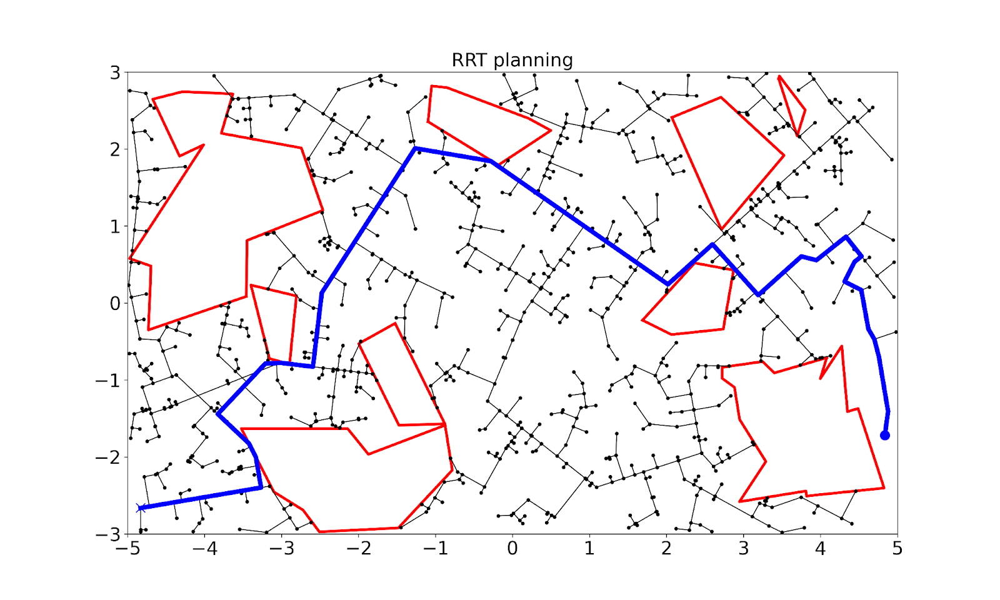

# Cuda_Path_planning_CPP

Using cuda to accelerate multiple path planning algorithms in simple and environments with varying complexity

Installation:
Use the env file with conda env create --file CPP_env.yml

To Run, here is an example:
$ python CPP.py --alg rrt_star --env complex

Arguments:
--alg, choices: prm, rrt, rrt_star 

--edge, choices: dubins, straight 

--env, choices: simple, complex, complex pro 
